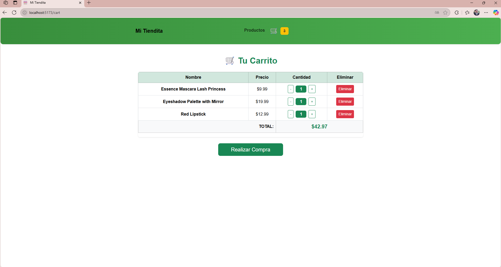

# Carrito de Compras - Proyecto Final

Este es un **proyecto de carrito de compras** desarrollado como trabajo final para la asignatura **Programación y Servicios Web** (nivel Técnico) en **CIAF**.

## Descripción

La aplicación permite:
- Visualizar productos por categorías.
- Buscar productos por nombre.
- Agregar y quitar productos del carrito.
- Ver el resumen y total de la compra.
- Simular la impresión del pedido.

## Requisitos

- npm (v8 o superior) o yarn

## Instalación

1. **Clona el repositorio:**
   ```bash
   git clone https://github.com/tu-usuario/tu-repo-carrito.git
   cd tu-repo-carrito

2. **Instala las dependencias:**
   npm install

   o si usas yarn:
   yarn install

3. **Ejecución
Para correr el proyecto en modo desarrollo:**
   npm run dev

   o

   yarn dev

4. Luego abre tu navegador en http://localhost:5173 (o el puerto que indique la terminal).

**Estructura principal**
components — Componentes reutilizables (NavBar, Card, etc.)
paginas — Páginas principales (Home, Productos, Carrito)
context — Contextos y providers de React
styles — Archivos CSS organizados por componente
assets — Imágenes y recursos estáticos
Créditos
Desarrollado por **Jonathan Cañola Salazar** para **CIAF**.

### Ejemplo de la aplicación





